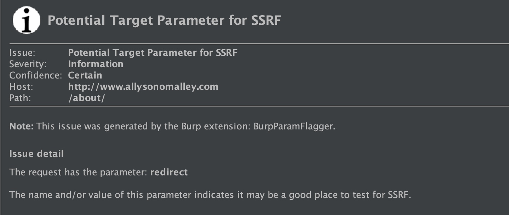
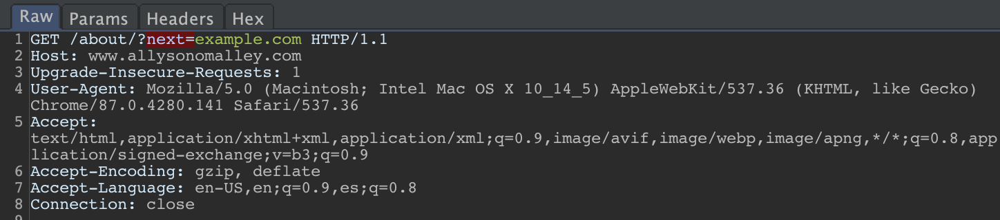
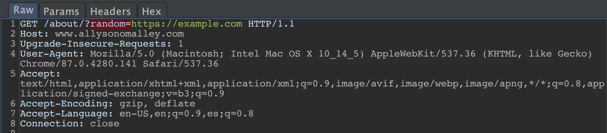

# BurpParamFlagger

A Burp extension adding a passive scan check to flag parameters whose name or value may indicate a possible insertion point for SSRF or LFI.

*Note:* I believe that Burp Pro is required to use this extension, since it adds onto the scanner functionality, which isn't included in the Community version.

The extension will look at both the **name** of a parameter and the **value** of that parameter and look for any common words or patterns indicating that it could be an insertion point for SSRF or LFI. 

For example, SSRF checks include looking for parameter names like 'redirect', 'url', or 'domain', as well as looking for values that look like a URL.

LFI checks look for names like 'include', 'attach', or 'file', and look for values that have a file extension.

A few basic examples:

## Installation

Just clone the repo and load the extension into Burp: Go to the Extender tab, click 'Add', change the extension type to 'Python', provide the cloned BurpParamFlagger.py file, and follow the next prompts.

## Usage

Once the extension is loaded, nothing more is needed. You should start seeing any flagged requests with your other scanner issues on the Dashboard.
